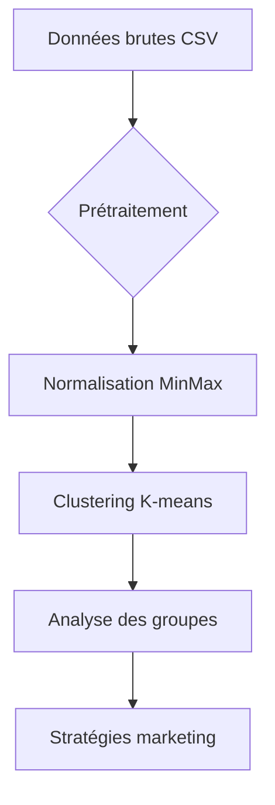

# 🛒 Segmentation Client par K-means : Guide Complet


## 🌟 Fonctionnalités

- Clustering automatique des clients
- Génération de rapports visuels
- Export des résultats en CSV
- Personnalisation facile des paramètres

## 🧠 Comment ça marche ?



## 🛠 Installation

### Prérequis

- Python 3.8+
- Gestionnaire de paquets `pip`

```bash
# 1. Cloner le dépôt
git clone https://github.com/votre-utilisateur/kmeans-supermarche.git && cd kmeans-supermarche

# 2. Installer les dépendances
pip install -r requirements.txt
```

> **Fichier requirements.txt**
>
> ```txt
> pandas==1.5.3
> scikit-learn==1.2.2
> matplotlib==3.7.1
> openpyxl==3.1.2
> ```

## 📈 Exécution

```bash
python kmeans.py
```

## 🔍 Explication du Code

### Étape clé 1 : Chargement des données

```python
import pandas as pd
data = pd.read_csv("donnees_clients.csv")  # Format attendu : ID, Montant, Fréquence
```

### Étape clé 2 : Normalisation

```python
from sklearn.preprocessing import MinMaxScaler
scaler = MinMaxScaler()  # Mise à l'échelle [0-1]
data_scaled = scaler.fit_transform(data[["Montant_Mensuel", "Frequence_Visites"]])
```

### Étape clé 3 : Clustering

```python
from sklearn.cluster import KMeans
kmeans = KMeans(
    n_clusters=3,        # Nombre de groupes
    random_state=42,     # Reproductibilité
    n_init=10            # Itérations pour stabilité
)
data["Cluster"] = kmeans.fit_predict(data_scaled)
```

## 📊 Interprétation des Résultats

| Cluster | Comportement               | Action Marketing   |
| ------- | -------------------------- | ------------------ |
| 0       | 🛍️ Fréquent/Petit panier   | Programme fidélité |
| 1       | 💎 Occasionnel/Gros budget | Offres premium     |
| 2       | ⚖️ Mixte                   | Bundling produits  |

## 🚨 Dépannage

**Problème** : Erreur de normalisation  
**Solution** :

```python
# Vérifier les valeurs nulles
print(data.isnull().sum())
data = data.dropna()  # ou .fillna(value)
```

## 📚 Ressources

- [Documentation KMeans](https://scikit-learn.org/stable/modules/generated/sklearn.cluster.KMeans.html)
- [Guide pandas avancé](https://pandas.pydata.org/pandas-docs/stable/user_guide/advanced.html)

<div align="center" style="margin-top: 40px;">
  ✨ **Équipe Projet** ✨<br>
  [Mariatou Maïga] | [Sidiki Pléa] | [Ayouba Morba]<br>
  [](LICENSE)
</div>
